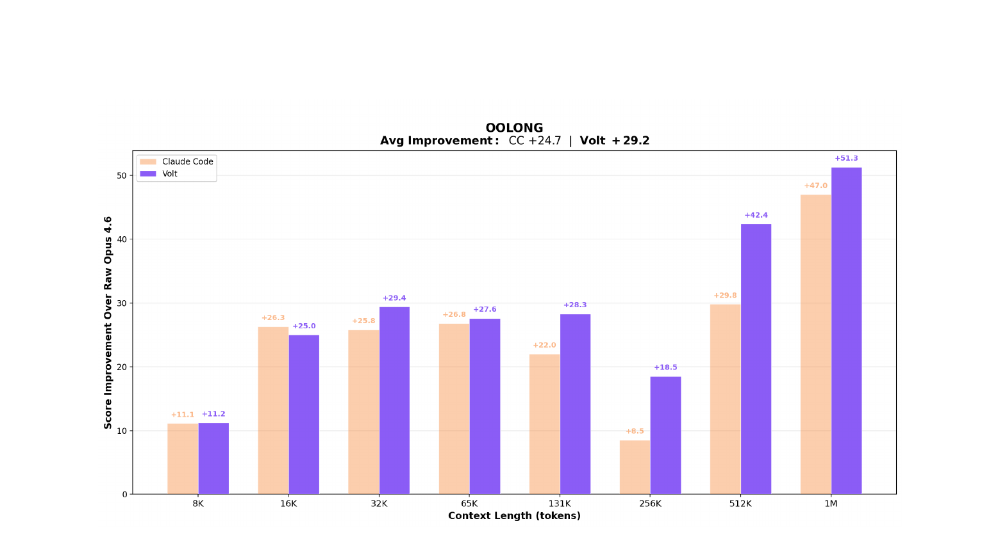
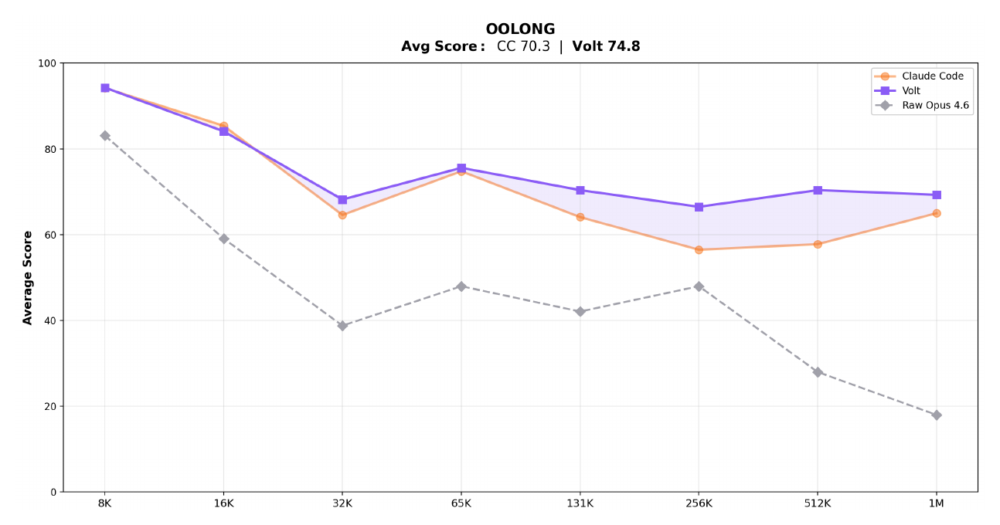
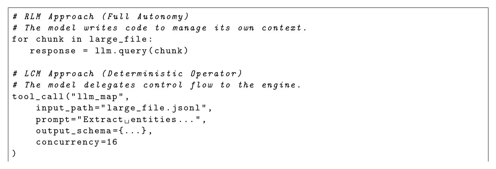

<p align="center">
  <h1 align="center">mnesis</h1>
  <p align="center"><em>Lossless Context Management for long-horizon LLM agents</em></p>
  <p align="center">
    <a href="https://pypi.org/project/mnesis/"></a>
    <a href="https://pypi.org/project/mnesis/"></a>
    <a href="LICENSE"></a>
    <a href="https://github.com/Lucenor/mnesis/actions"></a>
  </p>
</p>

---

LLMs suffer from **context rot**: accuracy degrades 30–40% before hitting nominal token limits — not because the model runs out of space, but because reasoning quality collapses as the window fills with stale content.

The standard fix — telling the model to "summarize itself" — is unreliable. The model may silently drop constraints, forget file paths, or produce a summary that is itself too large.

**mnesis** solves this by making the *engine* — not the model — responsible for memory. It is a Python implementation of the [LCM: Lossless Context Management](docs/LCM.pdf) architecture.

---

## Benchmarks

Evaluated on [OOLONG](https://github.com/abertsch72/oolong), a long-context reasoning and aggregation benchmark. Both LCM-managed and Claude Code agents are built on Claude Opus 4.6; the gap comes entirely from context architecture.

> The charts below compare LCM-managed context against Claude Code and unmanaged Opus 4.6 across context lengths from 8K to 1M tokens.

**Score improvement over raw Opus 4.6 at each context length:**



**Absolute scores vs raw Opus 4.6 baseline:**



Raw Opus 4.6 uses no context management — scores collapse past 32K tokens.

---

## How it works

Traditional agentic frameworks ("RLM" — Recursive Language Models) ask the model to manage its own context via tool calls. LCM moves that responsibility to a deterministic engine layer:



The engine handles memory deterministically so the model can focus entirely on the task.

---

## Key properties

| | RLM (e.g. raw Claude Code) | mnesis |
|---|---|---|
| Context trigger | Model judgment | Token threshold |
| Summarization failure | Silent data loss | Three-level fallback — never fails |
| Tool output growth | Unbounded | Backward-scan pruner |
| Large files | Inline (eats budget) | Content-addressed references |
| Parallel workloads | Sequential or ad-hoc | `LLMMap` / `AgenticMap` operators |
| History | Ephemeral | Append-only SQLite log |

---

## Quick Start

```bash
uv add mnesis
```

```python
import asyncio
from mnesis import MnesisSession

async def main():
    async with await MnesisSession.create(
        model="anthropic/claude-opus-4-6",
        system_prompt="You are a helpful assistant.",
    ) as session:
        result = await session.send("Explain the GIL in Python.")
        print(result.text)

asyncio.run(main())
```

No API key needed to try it — set `MNESIS_MOCK_LLM=1` and run any of the [examples](#examples).

---

## Core Concepts

### Immutable Store + Active Context
Every message and tool result is appended to an SQLite log and never modified. Each turn, the engine assembles a *curated view* of the log that fits the model's token budget — the Active Context.

### Three-Level Compaction
When token usage crosses the threshold, the `CompactionEngine` escalates automatically:

1. **Level 1** — Structured LLM summary: Goal / Discoveries / Accomplished / Remaining
2. **Level 2** — Aggressive compression: drop reasoning, maximum conciseness
3. **Level 3** — Deterministic truncation: no LLM, always fits, never fails

Compaction runs asynchronously and never blocks a turn.

### Tool Output Pruning
The `ToolOutputPruner` scans backward through history and tombstones completed tool outputs that fall outside a configurable protect window (default 40K tokens). Tombstoned outputs are replaced by a compact marker in the context — the data is still in the immutable store.

### Large File References
Files exceeding the inline threshold (default 10K tokens) are stored externally as `FileRefPart` objects with structural exploration summaries — AST outlines for Python, schema keys for JSON/YAML, headings for Markdown. The file is never re-read unless the model explicitly requests it.

### Parallel Operators
- **`LLMMap`** — stateless parallel LLM calls over a list of inputs with Pydantic schema validation and per-item retry. O(1) context cost to the caller.
- **`AgenticMap`** — independent sub-agent sessions per input item, each with full multi-turn reasoning. The parent session sees only the final output.

---

## Configuration

```python
from mnesis import MnesisConfig, CompactionConfig, FileConfig

config = MnesisConfig(
    compaction=CompactionConfig(
        auto=True,
        buffer=20_000,               # tokens reserved for compaction output
        prune=True,
        prune_protect_tokens=40_000, # never prune within last 40K tokens
        prune_minimum_tokens=20_000, # skip pruning if volume is too small
        level2_enabled=True,
    ),
    file=FileConfig(
        inline_threshold=10_000,     # files > 10K tokens → FileRefPart
    ),
    doom_loop_threshold=3,           # consecutive identical tool calls before warning
)
```

| Parameter | Default | Description |
|---|---|---|
| `compaction.auto` | `True` | Auto-trigger on overflow |
| `compaction.buffer` | `20,000` | Tokens reserved for summary output |
| `compaction.prune_protect_tokens` | `40,000` | Recent tokens never pruned |
| `compaction.prune_minimum_tokens` | `20,000` | Minimum prunable volume |
| `file.inline_threshold` | `10,000` | Inline limit in tokens |
| `operators.llm_map_concurrency` | `16` | `LLMMap` parallel calls |
| `operators.agentic_map_concurrency` | `4` | `AgenticMap` parallel sessions |
| `doom_loop_threshold` | `3` | Identical tool call threshold |

---

## Examples

All examples run without an API key via `MNESIS_MOCK_LLM=1`:

```bash
MNESIS_MOCK_LLM=1 uv run python examples/01_basic_session.py
MNESIS_MOCK_LLM=1 uv run python examples/05_parallel_processing.py
```

| File | Demonstrates |
|---|---|
| `examples/01_basic_session.py` | `create()`, `send()`, context manager, compaction monitoring |
| `examples/02_long_running_agent.py` | EventBus subscriptions, streaming callbacks, manual `compact()` |
| `examples/03_tool_use.py` | Tool lifecycle, `ToolPart` streaming states, tombstone inspection |
| `examples/04_large_files.py` | `LargeFileHandler`, `FileRefPart`, cache hits, exploration summaries |
| `examples/05_parallel_processing.py` | `LLMMap` with Pydantic schema, `AgenticMap` sub-sessions |

---

## API Reference

See [docs/api.md](docs/api.md) for the full API reference.

---

## Architecture

```
MnesisSession
├── ImmutableStore         (SQLite append-only log)
├── SummaryDAGStore        (logical DAG over is_summary messages)
├── ContextBuilder         (assembles LLM message list each turn)
├── CompactionEngine       (three-level escalation + atomic commit)
│   ├── ToolOutputPruner   (backward-scanning tombstone pruner)
│   └── levels.py          (level 1 / 2 / 3 functions)
├── LargeFileHandler       (content-addressed file references)
├── TokenEstimator         (tiktoken + heuristic fallback)
└── EventBus               (in-process pub/sub)

Operators (independent of session)
├── LLMMap                 (parallel stateless LLM calls)
└── AgenticMap             (parallel sub-agent sessions)
```

---

## Contributing

Contributions are welcome — bug reports, feature requests, and pull requests alike.

See [CONTRIBUTING.md](CONTRIBUTING.md) for the full guide. The short version:

```bash
# Clone and install with dev dependencies
git clone https://github.com/Lucenor/mnesis.git
cd mnesis
uv sync --dev

# Lint + format
uv run ruff check src/ tests/
uv run ruff format src/ tests/

# Type check
uv run mypy src/mnesis

# Test (with coverage)
uv run pytest

# Run examples without API keys
MNESIS_MOCK_LLM=1 uv run python examples/01_basic_session.py
MNESIS_MOCK_LLM=1 uv run python examples/05_parallel_processing.py
```

Open an issue before starting large changes — it avoids duplicated effort.

---

## License

Apache 2.0 — see [LICENSE](LICENSE) and [NOTICE](NOTICE).
