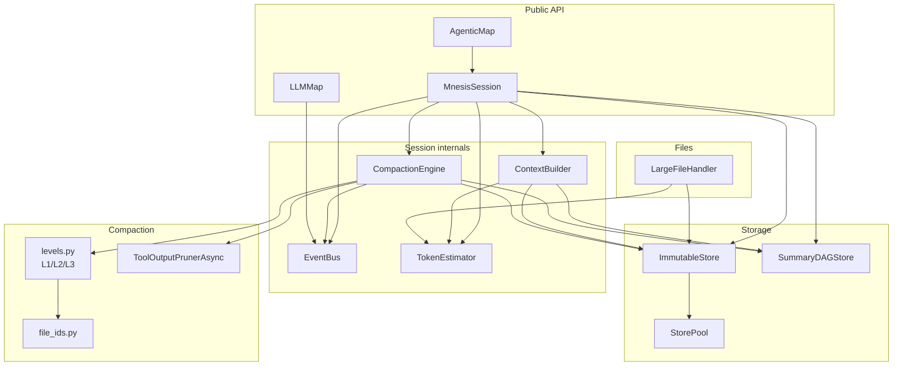
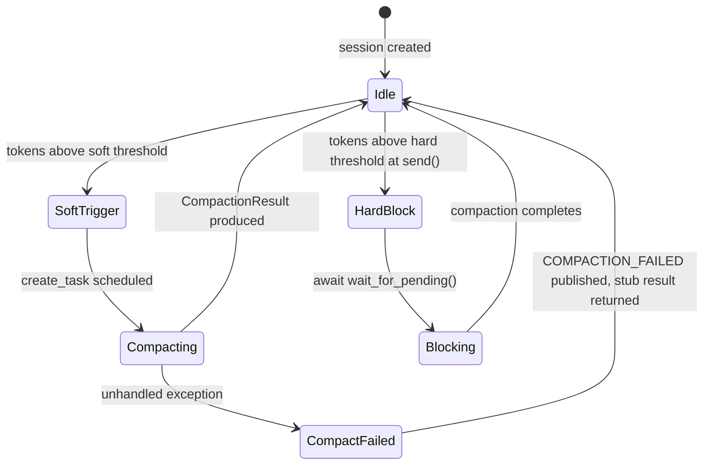

# Architecture

This page is a deep-dive into how Mnesis works internally. Every claim is
derived directly from the source code — no documentation or README was used as
a primary source. Readers who want to extend or debug the library should start
here.

---

## Component Overview



---

## `session.send()` Walkthrough

`send()` is defined in `src/mnesis/session.py`. The following is the exact
sequence as it executes, step by step.

```mermaid
sequenceDiagram
    participant Caller
    participant Session
    participant Store as ImmutableStore
    participant Engine as CompactionEngine
    participant Builder as ContextBuilder
    participant SDS as SummaryDAGStore
    participant LLM

    Caller->>Session: send("message")
    Session->>Session: normalize to TextPart list
    Session->>Store: append_message(user_msg)
    Store->>Store: INSERT INTO messages; INSERT INTO context_items
    Session->>Store: append_part(raw_part) for each user part
    Store->>Store: INSERT INTO message_parts

    Session->>Session: event_bus.publish(MESSAGE_CREATED, user)

    alt cumulative tokens >= hard threshold
        Session->>Engine: check_and_trigger() if no pending task
        Session->>Engine: await wait_for_pending() [BLOCKS]
    end

    Session->>Builder: build(session_id, model_info, sys_prompt, config)
    Builder->>Store: get_context_items(session_id)
    Builder->>Store: get_messages_with_parts_by_ids(message_ids)
    Builder->>SDS: get_node_by_id(summary_id) for each summary item
    Builder-->>Session: BuiltContext(messages, token_estimate)

    Session->>Store: append_message(assistant_msg) [pre-commit row]

    Session->>LLM: litellm.acompletion(stream=True)
    LLM-->>Session: stream TextPart chunks
    Session-->>Caller: on_part(TextPart) callbacks

    Session->>Store: append_part(text_raw with token_estimate)
    Session->>Store: update_message_tokens(assistant_msg_id, final_tokens)

    Session->>Session: cumulative_tokens += final_tokens
    Session->>Session: _check_doom_loop()

    alt cumulative tokens >= soft threshold
        Session->>Engine: check_and_trigger() [non-blocking, asyncio.create_task]
        Note over Engine: runs in background
    end

    Session->>Session: event_bus.publish(MESSAGE_CREATED, assistant)
    Session-->>Caller: TurnResult(text, tokens, compaction_triggered)
```

**Key observations derived from the source:**

1. The user message row (`messages` table) and its `context_items` entry are
   both committed before the LLM call happens. If the process dies mid-stream,
   the user turn is already durable.

2. The assistant message row is inserted *before* streaming begins (a stub row
   with no tokens). Token counts are written after streaming completes via
   `update_message_tokens()`. This is the only mutation of a message row
   permitted by `ImmutableStore`.

3. Hard-threshold blocking (`await wait_for_pending()`) happens *before*
   `ContextBuilder.build()` is called, ensuring the LLM never sees an
   over-limit context.

4. Soft-threshold compaction fires *after* the turn completes via
   `asyncio.create_task()`. The current turn is not delayed.

5. The `on_part` streaming callback is invoked inline for both sync and async
   handlers. If the callback returns a coroutine (async handler), that coroutine
   is awaited immediately via an `asyncio.iscoroutine` check. Both handler
   styles are supported, but slow handlers will delay streaming throughput.

---

## ImmutableStore Guarantees

`ImmutableStore` (`src/mnesis/store/immutable.py`) sits on top of `aiosqlite`.
The schema lives in `src/mnesis/store/schema.sql`.

### SQL schema (core tables)

| Table | Purpose |
|---|---|
| `sessions` | One row per `MnesisSession.create()` call |
| `messages` | One row per user or assistant turn (also compaction summaries) |
| `message_parts` | One row per `MessagePart` within a message |
| `context_items` | The ordered "what is currently in context" view |
| `summary_nodes` | DAG metadata for compaction summary nodes |
| `file_references` | Content-addressed large file cache |

### Append-only guarantee

`append_message()` and `append_part()` both execute `INSERT` statements. There
is no `DELETE` or `UPDATE` on the `messages` or `message_parts` tables for
business content. The only permitted mutations are:

- `update_message_tokens()` — writes `tokens_*`, `cost`, and `finish_reason`
  on an assistant message after streaming finishes. This is the single allowed
  mutation on `messages`.
- `update_part_status()` — writes `tool_state`, `compacted_at`,
  `started_at`, `completed_at`, and optionally merges `output`/`error_message`
  into the `content` JSON. This is the single allowed mutation on
  `message_parts`. Setting `compacted_at` to a non-null Unix millisecond
  timestamp is what constitutes a **tombstone**.

### What a tombstone is

A tombstone is a `message_parts` row whose `compacted_at` column is non-null.
The row is never deleted. `ImmutableStore._deserialize_part()` reads back the
`compacted_at` value and sets it on the resulting `ToolStatus.compacted_at`
field. `ContextBuilder._convert_message()` then checks `part.compacted_at is
not None` and replaces the tool output with a one-line string:

```
[Tool 'tool_name' output compacted at <unix_ms>]
```

The original tool output remains in the database under `content` JSON, fully
recoverable for auditing.

### `context_items` — the O(1) context view

Every non-summary `append_message()` call atomically inserts a row into
`context_items` in the same transaction:

```sql
INSERT INTO context_items (session_id, item_type, item_id, position, created_at)
SELECT ?, 'message', ?, COALESCE(MAX(position), 0) + 1, ?
FROM context_items WHERE session_id = ?
```

The `MAX(position) + 1` subquery is computed atomically inside the INSERT,
preventing position races on concurrent appends. When compaction runs,
`swap_context_items()` atomically DELETEs the compacted message rows and
INSERTs one `'summary'` row at the minimum position of the deleted rows — all
in a single transaction.

`ContextBuilder` then assembles context by reading just this table (one SELECT)
rather than scanning all messages. This makes context assembly O(k) in the
number of current context items, not O(n) in total session length.

### Connection pooling (`StorePool`)

`StorePool` (`src/mnesis/store/pool.py`) maintains one `aiosqlite.Connection`
per resolved database path. Multiple `ImmutableStore` objects sharing the same
path share one connection. This is essential for `AgenticMap` where many
parallel sub-sessions would otherwise each open a connection to the same
SQLite file and fight over the write lock. The pool uses a per-path
`asyncio.Lock` to prevent concurrent connection-open races. WAL mode is
enabled at connection time, permitting unlimited concurrent readers alongside
one writer.

When `close()` is called on an `ImmutableStore` that uses a pool, the method
is a no-op — the pool owns the connection lifetime. Pool shutdown happens via
`pool.close_all()` at application teardown.

---

## ContextBuilder Assembly

`ContextBuilder.build()` (`src/mnesis/context/builder.py`) runs on every
`send()` call. It returns a `BuiltContext` carrying a `messages: list[LLMMessage]`
and a `token_estimate`.

### Step-by-step assembly

**Step 1 — Compute budget.**
```
usable = model.context_limit - model.max_output_tokens - config.compaction.compaction_output_budget
available = usable - system_prompt_tokens
```

**Step 2 — Read `context_items`.**
A single `SELECT item_type, item_id FROM context_items WHERE session_id = ? ORDER BY position ASC`
returns the current ordered snapshot. If the table is empty (upgraded database
with no migration path), a backward-compatibility scan of all session messages
is performed instead.

**Step 3 — Reserve summary budget.**
For each `item_type = 'summary'` entry, `SummaryDAGStore.get_node_by_id()` is
called to retrieve the `SummaryNode`. Its `token_count` is accumulated and
subtracted from `available`. Summary nodes are cached within the build call to
avoid repeated round-trips.

**Step 4 — Walk messages newest-to-oldest.**
Message IDs from `context_items` are fetched via
`get_messages_with_parts_by_ids()` (one SQL query). The builder iterates in
reverse order, accumulating token counts with `estimator.estimate_message()`,
and breaks as soon as adding the next message would exceed `available`. Excluded
messages (budget overflow) are silently omitted — the LLM never sees them.

**Step 5 — Convert to `LLMMessage` list.**
The final list is assembled in position order:

1. Summary nodes (injected as `role="assistant"` messages with the summary text as content).
2. Raw messages that fit the budget (chronological order restored by `.reverse()`).

Within each raw message, `_convert_message()` applies:
- `TextPart` — appended verbatim.
- `ToolPart` with `compacted_at is not None` — replaced with the tombstone string.
- `ToolPart` with no tombstone — rendered as a `[Tool: name] ... [/Tool]` block.
- `FileRefPart` — rendered as a `[FILE: path] ... [/FILE]` block.

**Precedence when things do not fit:**
The most recent messages always take priority. Older messages are dropped first.
If summary nodes are so large they consume the entire budget, raw messages may
be completely absent from the assembled context (only summaries remain). This
is an extreme edge case handled by the multi-round condensation loop.

---

## Compaction Lifecycle



### Thresholds

- **Soft threshold**: `soft_threshold_fraction * usable` (default 60%).
  Checked after each turn completes. If crossed, `check_and_trigger()` calls
  `asyncio.create_task(run_compaction())` and returns `True` immediately. The
  current turn is not affected.

- **Hard threshold**: `usable` (100%).
  Checked at the *start* of `send()`, before the LLM call. If the hard limit
  is crossed, `send()` triggers or waits for the in-flight compaction task
  (`await wait_for_pending()`) before proceeding. This prevents sending an
  over-limit context to the provider.

### `run_compaction()` sequence

`CompactionEngine.run_compaction()` is the outer entry point. It wraps
`_run_compaction_inner()` in a `try/except` so that unexpected exceptions do
not crash the caller. On exception, `COMPACTION_FAILED` is published and a
stub `CompactionResult` (no summary committed) is returned. Level 3 is not
forced by this handler — Level 3 is only the final fallback inside
`_run_summarisation()` when Level 1/2 return `None`.

The inner sequence for each round:

1. **Tool output pruning** — `ToolOutputPrunerAsync.prune()` tombstones stale
   tool outputs (see [ToolOutputPruner](#tooloutputpruner) below).

2. **Summarisation** — `_run_summarisation()` attempts Level 1, then Level 2
   (if enabled), then Level 3. Returns a `SummaryCandidate`.

3. **Commit** — `SummaryDAGStore.insert_node()` writes the summary as a
   `Message(is_summary=True)` row plus a `TextPart` and a `CompactionMarkerPart`.
   Then `ImmutableStore.swap_context_items()` atomically replaces the compacted
   message entries with one `'summary'` entry.

4. **Condensation loop** (if `condensation_enabled=True`) — while
   `tokens_after > budget.usable` and `len(active_nodes) >= 2`, the engine
   calls `_run_condensation()` to merge all live `SummaryNode` objects into a
   single condensed node. The consumed nodes are marked superseded via
   `SummaryDAGStore.mark_superseded()`. Loop runs up to `max_compaction_rounds`
   times, breaking early if no progress is made.

5. **Event** — `EventBus.publish(COMPACTION_COMPLETED, ...)` is fired with the
   full `CompactionResult` payload.

The `EventBus.publish(COMPACTION_TRIGGERED, ...)` fires synchronously inside
`check_and_trigger()` before the task is created.

### Background vs. foreground interaction

The `_pending_task: asyncio.Task | None` attribute on `CompactionEngine` is the
sole coordination point between the compaction background task and the foreground
`send()` loop. The session's `compaction_in_progress` property reads this:

```python
task = self._compaction_engine._pending_task
return task is not None and not task.done()
```

`close()` awaits this task before releasing the database connection, ensuring
no in-flight write is interrupted.

---

## Three Compaction Levels

All three levels are implemented in `src/mnesis/compaction/levels.py`.

### What all levels share

- **Protection window**: `_messages_to_summarise()` keeps the two most recent
  user turns out of scope. Only messages *before* the second-to-last user turn
  are candidates for summarisation.

- **Input cap**: `_apply_input_cap()` trims messages to at most 75% of the
  compaction model's context window before passing them to the LLM. At least 3
  messages are always included (`MIN_MESSAGES_TO_SUMMARISE = 3`).

- **File ID preservation**: `extract_file_ids_from_messages()` collects all
  `file_xxx` identifiers from the input. `append_file_ids_footer()` appends a
  `[LCM File IDs: ...]` footer to every summary. Level 3 collects IDs from
  *all* messages (including those truncated), ensuring file references are never
  lost even when prose is discarded.

- **Convergence check** (L1 and L2 only): If the summary token count is >=
  the input token count, the LLM failed to compress. The level returns `None`
  and the next level is tried.

### Level 1 — Structured LLM summary

Uses `LEVEL1_PROMPT`, which requests a structured format with eight sections:
Goal, Key Instructions & Constraints, Discoveries & Findings, Completed Work,
In Progress, Remaining Work, Relevant Files & Directories, Other Important
Context.

`max_tokens` passed to the LLM equals `budget.reserved_output_tokens`
(default 8,192).

Returns `None` if the LLM call fails, the result exceeds `budget.usable`, or
the result is not smaller than the input.

### Level 2 — Aggressive LLM summary

Uses `LEVEL2_PROMPT`, which requests a five-field compact format: GOAL,
CONSTRAINTS, FILES, NEXT, CONTEXT. Each message is truncated to 500 characters
before building the transcript. `max_tokens` is `min(budget.compaction_buffer, 4000)`.

Level 2 is only attempted if `config.compaction.level2_enabled=True` (default).

Returns `None` on the same conditions as Level 1.

### Level 3 — Deterministic truncation

No LLM call. Walks messages in reverse order, keeping those that fit within
85% of `budget.usable`. Prepends `[CONTEXT TRUNCATED — DETERMINISTIC FALLBACK]`.
Always returns a valid `SummaryCandidate` — this is the invariant that prevents
the system from ever deadlocking on compaction.

### Escalation flow

```
_run_summarisation():
  try Level 1
  if None and level2_enabled: try Level 2
  if still None: run Level 3 (always succeeds)
  return candidate
```

### Condensation levels

When multiple summary nodes accumulate and the context is still over budget,
condensation merges them. Three levels mirror summarisation:

- **Condense L1** — `CONDENSE_LEVEL1_PROMPT` merged all summaries via
  structured format.
- **Condense L2** — `CONDENSE_LEVEL2_PROMPT` aggressive single-turn merge
  (each summary truncated to 800 chars).
- **Condense L3** — deterministic: concatenates node content up to
  `_CONDENSE_LEVEL3_MAX_TOKENS = 512` tokens. Always succeeds.

---

## ToolOutputPruner

`ToolOutputPrunerAsync` (`src/mnesis/compaction/pruner.py`) runs as the first
step of every compaction pass.

### What it tombstones vs. protects

The pruner scans the message history backward, tracking:

- **Protected: most recent user turn** — `user_turn_count < 2`: skip all
  messages until the backward scan has encountered 2 user turns. In practice
  this protects the most recent user turn and all messages between it and the
  second-most-recent user turn; the second-most-recent user turn itself is
  the first message that is eligible for pruning.
- **Protected: summary message boundaries** — stop scanning when
  `msg.is_summary` is encountered. Tool outputs before the last compaction
  boundary are not re-pruned.
- **Protected tool names**: `_PROTECTED_TOOLS = frozenset({"skill"})`.
- **Already-tombstoned parts**: `part.compacted_at is not None` — stop
  scanning that message's tool parts.
- **Protect window**: a rolling token count accumulates output tokens. Parts
  that push the cumulative total above `prune_protect_tokens` (default 40,000)
  are candidates; those within the window are skipped.
- **Minimum volume gate**: if total prunable tokens <= `prune_minimum_tokens`
  (default 20,000), the entire prune pass is skipped — no tombstones are
  written.

Only `completed` tool parts (not `pending`, `running`, or `error`) outside the
protect window are tombstoned.

### What a tombstone looks like

In SQLite: `message_parts.compacted_at = <unix_ms>`. The `content` JSON is
unchanged.

When deserialized by `ImmutableStore._deserialize_part()`: the `compacted_at`
value is written into `ToolStatus.compacted_at` on the `ToolPart`.

In the assembled context (via `ContextBuilder._convert_message()`): the entire
tool content is replaced with:

```
[Tool 'tool_name' output compacted at 1736000000000]
```

This one-line string costs approximately 10–15 tokens regardless of how large
the original tool output was.

---

## Large File Handling

`LargeFileHandler` (`src/mnesis/files/handler.py`) intercepts files before
they are added to context.

### Flow from call site to `FileRefPart`

1. Caller calls `handler.handle_file(path)`.
2. `LargeFileHandler` reads the file and estimates tokens via `TokenEstimator`.
3. If `token_count < FileConfig.inline_threshold` (default 10,000 tokens):
   return `FileHandleResult(inline_content=content_str)`. The file goes into
   the message as a `TextPart`.
4. If at or above threshold:
   a. Compute `content_id = sha256(content_str)`.
   b. Query `ImmutableStore.get_file_reference(content_id)`. Cache hit returns
      immediately with the cached `exploration_summary`.
   c. Cache miss: detect file type (extension map → binary heuristic →
      `python-magic` fallback → `"unknown"`). Generate exploration summary:
      - Python: AST walk, extracts classes, functions, imports.
      - JSON: top-level key list and array fields.
      - YAML: top-level key list (via `yaml.safe_load`).
      - TOML: section list (via `tomllib`).
      - Markdown: heading hierarchy.
      - CSV/TSV: column list and row count.
      - TypeScript/JavaScript: regex-based exports, classes, functions, imports.
      - All others: line count + 5-line preview.
   d. Store `FileReference` in `file_references` table via
      `ImmutableStore.store_file_reference()`.
   e. Return `FileHandleResult(file_ref=FileRefPart(...))`.

**What lives where:**

| Location | Content |
|---|---|
| Disk | Raw file content (not stored by Mnesis — caller owns it) |
| `file_references` table | `content_id`, `path`, `file_type`, `token_count`, `exploration_summary` |
| `message_parts` table | `FileRefPart` serialized as JSON (content_id + summary, no raw content) |
| LLM context | `[FILE: path]\nContent-ID: ...\n...\n[/FILE]` block |

The raw file content is never stored in the `ImmutableStore`. Only the
content hash and structural summary are persisted.

---

## Event Flow

`EventBus` (`src/mnesis/events/bus.py`) is a simple in-process pub/sub system.

### Handler execution model

- **Sync handlers**: called inline within `publish()` in registration order.
- **Async handlers**: scheduled via `asyncio.get_running_loop().create_task()`.
  If no event loop is running, the handler is silently skipped.
- Exceptions from any handler are caught and logged. They never propagate to
  the publisher.

### Who publishes what

| Publisher | Event | When |
|---|---|---|
| `MnesisSession.create()` | `SESSION_CREATED` | After store initialization |
| `MnesisSession.send()` | `MESSAGE_CREATED` (user) | After user parts persisted |
| `MnesisSession.send()` | `MESSAGE_CREATED` (assistant) | After assistant parts persisted |
| `MnesisSession.close()` | `SESSION_CLOSED` | After compaction drained |
| `CompactionEngine.check_and_trigger()` | `COMPACTION_TRIGGERED` | Before task created |
| `CompactionEngine._run_compaction_inner()` | `COMPACTION_COMPLETED` | On success |
| `CompactionEngine.run_compaction()` (outer) | `COMPACTION_FAILED` | On unhandled exception |
| `MnesisSession._check_doom_loop()` | `DOOM_LOOP_DETECTED` | When threshold consecutive identical calls found |
| `LLMMap.run()` | `MAP_STARTED`, `MAP_ITEM_COMPLETED`, `MAP_COMPLETED` | Operator lifecycle |
| `AgenticMap.run()` | `MAP_STARTED`, `MAP_ITEM_COMPLETED`, `MAP_COMPLETED` | Operator lifecycle |

### Session bus vs. operator bus

Each `MnesisSession` creates its own `EventBus` instance inside `create()`.
Operators (`LLMMap`, `AgenticMap`) have an optional `event_bus` constructor
parameter. If not provided (`event_bus=None`), operator events are not
published at all — the operator runs normally but emits no events.

To receive operator events on the session bus, inject it at construction:

```python
llm_map = LLMMap(config.operators, event_bus=session.event_bus)
agentic_map = AgenticMap(config.operators, event_bus=session.event_bus)
```

Sub-sessions created by `AgenticMap` each get their own `EventBus` (created
inside `MnesisSession.create()`). Their events are not automatically forwarded
to the parent session bus.

---

## LLMMap and AgenticMap

Both operators live in `src/mnesis/operators/`.

### How they relate to `MnesisSession`

Neither operator inherits from nor wraps `MnesisSession` at the class level.
The dependency graph is:

- **`LLMMap`** — no dependency on `MnesisSession`. Makes direct `litellm.acompletion()`
  calls for each item with no session state, no store, and no compaction. It
  accepts an optional `EventBus` for operator event delivery but otherwise
  operates entirely in memory.

- **`AgenticMap`** — creates one `MnesisSession` per input item via
  `MnesisSession.create()`. Each sub-session has its own store connection (via
  a shared `StorePool`), its own `CompactionEngine`, and its own `EventBus`.
  Sub-sessions do not share state with each other or with the parent caller.

### State isolation

| Resource | LLMMap | AgenticMap sub-session |
|---|---|---|
| `ImmutableStore` | None | Own session in shared `StorePool` |
| `CompactionEngine` | None | Own instance |
| `EventBus` | Optional shared or None | Own instance (events not forwarded) |
| Parent context window | Not consumed | Not consumed |
| Conversation history | None | Full multi-turn history in its own session |

The parent's context window cost for an `AgenticMap` call is O(1) per item:
only the final `output_text` from each sub-session is returned. The sub-session's
multi-turn history lives in its own SQLite rows.

### Concurrency control

Both operators use an `asyncio.Semaphore` to cap concurrent tasks:

- `LLMMap`: `llm_map_concurrency` (default 16).
- `AgenticMap`: `agentic_map_concurrency` (default 4).

Results are yielded via `asyncio.as_completed()`, so they stream back in
completion order, not input order. Use `result.input` to correlate with the
original input.

### Template validation

Both operators call `require_item_variable(template)` from
`src/mnesis/operators/template_utils.py`. This uses the Jinja2 AST parser
(not a regex) to confirm the template references `{{ item }}`. Templates that
do not reference `item` raise `ValueError` before any tasks are spawned.

---

## Design Invariants

These are the system-level invariants that all components are designed to
uphold, with the specific code locations where each is enforced.

### 1. The immutable store is append-only

No `DELETE` statement is ever executed on `messages` or `message_parts`.
Compaction content is managed exclusively through new rows and the
`context_items` view — old rows remain in the database for auditing and
recovery.

**Enforced by:** `ImmutableStore.append_message()`, `append_part()`, and the
absence of any `DELETE ... FROM messages` in the codebase. The only permitted
mutations are `update_message_tokens()` (status fields only) and
`update_part_status()` (`compacted_at` tombstone and tool lifecycle fields).

### 2. Compaction is asynchronous and non-blocking

`CompactionEngine.check_and_trigger()` always uses `asyncio.create_task()` and
returns immediately. The current turn completes before compaction begins.

**Exception:** when `cumulative_tokens >= hard_threshold` at the start of
`send()`, the call blocks via `await wait_for_pending()`. This is the designed
safety valve that prevents over-limit contexts from reaching the provider.

**Enforced by:** `send()` in `session.py`, lines checking
`is_hard_overflow()` before `ContextBuilder.build()`.

### 3. Level 3 compaction always succeeds

`level3_deterministic()` never calls the LLM. It truncates to a deterministic
subset of messages and always returns a `SummaryCandidate`. This ensures the
compaction loop cannot deadlock even if the LLM is unavailable or returns
garbage.

**Enforced by:** `_run_summarisation()` in `engine.py` — Level 3 is the final
`if candidate is None:` branch with no failure path.

### 4. File references are never lost through compaction

The `append_file_ids_footer()` function appends a `[LCM File IDs: ...]` block
to every summary, including Level 3 deterministic fallback. Level 3 collects
IDs from *all* messages before truncation — even those whose prose is
discarded.

**Enforced by:** `level3_deterministic()` calling
`extract_file_ids_from_messages(messages)` on the full message list before
any truncation occurs.

### 5. Context assembly is O(k) not O(n)

`ContextBuilder` reads `context_items` (one ordered SELECT) and then fetches
only the message IDs present in that snapshot. The total session message count
does not affect assembly time.

**Enforced by:** `ImmutableStore.get_context_items()` + `get_messages_with_parts_by_ids()`.

### 6. Concurrent sub-sessions share one SQLite connection

`AgenticMap` creates a `StorePool` (if none is provided) and passes it to
every `MnesisSession.create()` call. All sessions sharing the same pool for the
same `db_path` use one `aiosqlite.Connection`, preventing `database is locked`
errors under concurrent writes.

**Enforced by:** `StorePool.acquire()` with a per-path `asyncio.Lock` and
double-checked locking pattern.
