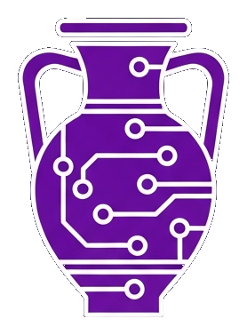
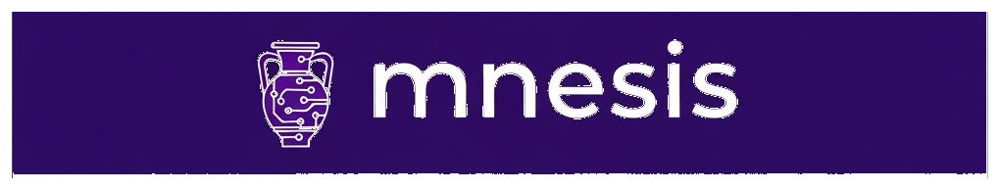

<p align="center">
  <br><br>
  <br><br>
  <em>Lossless Context Management for long-horizon LLM agents</em>
  <br><br>
  <a href="https://pypi.org/project/mnesis/"></a>
  <a href="https://pypi.org/project/mnesis/"></a>
  <a href="https://github.com/Lucenor/mnesis/blob/main/LICENSE"></a>
  <a href="https://github.com/Lucenor/mnesis/actions/workflows/ci.yml"></a>
  <a href="https://codecov.io/github/Lucenor/mnesis"></a>
  <a href="https://mnesis.lucenor.tech"></a>
  <a href="https://github.com/Lucenor/mnesis/attestations"></a>
  <a href="https://scorecard.dev/viewer/?uri=github.com/Lucenor/mnesis"></a>
</p>

---

LLMs suffer from **context rot**: accuracy degrades 30–40% before hitting nominal token limits — not because the model runs out of space, but because reasoning quality collapses as the window fills with stale content.

The standard fix — telling the model to "summarize itself" — is unreliable. The model may silently drop constraints, forget file paths, or produce a summary that is itself too large.

**mnesis** solves this by making the *engine* — not the model — responsible for memory. It is a Python implementation of the [LCM: Lossless Context Management](https://github.com/Lucenor/mnesis/blob/main/docs/LCM.pdf) architecture.

---

## Benchmarks

Evaluated on [OOLONG](https://github.com/abertsch72/oolong), a long-context reasoning and aggregation benchmark. Both LCM-managed and Claude Code agents are built on Claude Opus 4.6; the gap comes entirely from context architecture.

!!! info "Chart summary"
    The charts below compare LCM-managed context against Claude Code and unmanaged Opus 4.6 across context lengths from 8K to 1M tokens. Raw Opus 4.6 uses no context management — scores collapse past 32K tokens.

**Score improvement over raw Opus 4.6 at each context length:**


**Absolute scores vs raw Opus 4.6 baseline:**


---

## How it works

Traditional agentic frameworks ("RLM" — Recursive Language Models) ask the model to manage its own context via tool calls. LCM moves that responsibility to a deterministic engine layer:


The engine handles memory deterministically so the model can focus entirely on the task.

---

## Key properties

<div class="grid cards" markdown>

- :material-lightning-bolt: **Context trigger**

  ---

  RLM uses model judgment. mnesis uses a configurable **token threshold** — deterministic, not probabilistic.

- :material-shield-check: **Summarization failure**

  ---

  RLM risks silent data loss. mnesis has a **three-level fallback** that never fails — Level 3 is always deterministic.

- :material-tools: **Tool output growth**

  ---

  RLM lets tool outputs grow unbounded. mnesis uses a **backward-scan pruner** to tombstone stale outputs.

- :material-file-document: **Large files**

  ---

  RLM inlines files, eating the token budget. mnesis uses **content-addressed file references** with structural summaries.

- :material-view-parallel: **Parallel workloads**

  ---

  RLM is sequential or ad-hoc. mnesis provides `LLMMap` and `AgenticMap` **operators** for true parallelism.

- :material-database: **History**

  ---

  RLM history is ephemeral. mnesis keeps an **append-only SQLite log** — nothing is ever deleted.

</div>

---

## Quick install

```bash
uv add mnesis
# or
pip install mnesis
```

```python
import asyncio
from mnesis import MnesisSession

async def main():
    async with await MnesisSession.create(
        model="anthropic/claude-opus-4-6",
        system_prompt="You are a helpful assistant.",
    ) as session:
        result = await session.send("Explain the GIL in Python.")
        print(result.text)

asyncio.run(main())
```

No API key needed to try it — set `MNESIS_MOCK_LLM=1` and run any of the [examples](examples.md).

---

## Provider support

mnesis works with any LLM provider via [litellm](https://docs.litellm.ai/). Pass the model string and set the corresponding API key:

| Provider | Model string | API key env var |
|---|---|---|
| Anthropic | `"anthropic/claude-opus-4-6"` | `ANTHROPIC_API_KEY` |
| OpenAI | `"openai/gpt-4o"` | `OPENAI_API_KEY` |
| Google Gemini | `"gemini/gemini-1.5-pro"` | `GEMINI_API_KEY` |
| OpenRouter | `"openrouter/meta-llama/llama-3.1-70b-instruct"` | `OPENROUTER_API_KEY` |

See the [Provider Configuration guide](providers.md) for the full list.

---

Jump to [Getting Started](getting-started.md) for a full walkthrough.
